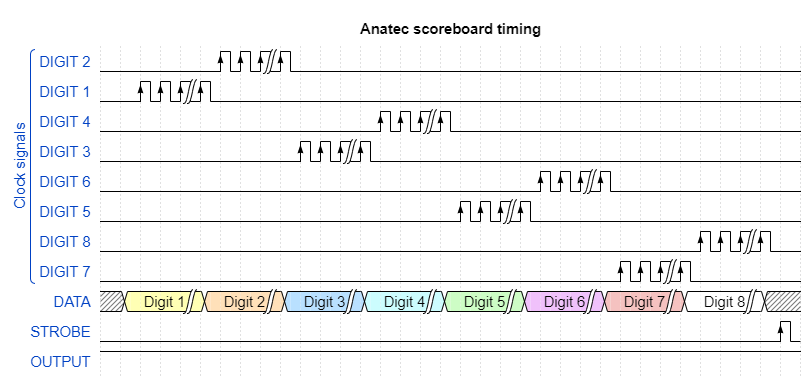

# DataDisplay Interface (Blue Pill + Raspberry Pi)

This section describes how scoreboard signals are captured, decoded, and forwarded to vMix using an STM32 “Blue Pill” for real‑time sampling and a Raspberry Pi for transport and API integration. The design combines deterministic signal acquisition with a simple and maintainable host service.

Goals:
- Non‑invasive tap of the existing scoreboard bus
- Deterministic capture of fast scan timing
- Low‑latency updates to vMix
- Resilience to noise and partial frames
- Straightforward deployment, logging, and monitoring

High‑level flow:
1. Capture on the Blue Pill: external interrupts and a timer observe the data bus, per‑digit clocks, and latch. A compact state machine reconstructs digits/fields, normalizes values, and filters transient glitches.
2. Framing and transport: updates are serialized over UART (8N1, configurable baud) with start/end markers, a checksum/CRC, and a periodic heartbeat for liveness.
3. Host service on the Raspberry Pi: a Python process reads frames, validates checksums, de‑duplicates values, maps fields to vMix input titles, and sends only changed fields via the vMix API. Logging, backoff/retry, and a watchdog are included.
4. Rate limiting and consistency: updates are coalesced per scan cycle to prevent flicker; ambiguous or out‑of‑range states are held until a stable frame confirms them.
5. Operations: on boot, the Pi starts the receiver and API client; the Blue Pill begins capturing immediately and idles if no clocks are present.

Electrical notes:
- The Blue Pill is 3.3 V; if the scoreboard bus is 5 V TTL, add level shifting or safe series/diode clamping.
- A common ground is required; do not power the scoreboard from the MCU or Pi.
- Tap only the bus, digit clocks, and latch/strobe; avoid modifying original PCB traces.

Planned evolution:
- Replace the UART/Pi hop with direct Ethernet from the MCU
- Version the on‑wire protocol with formal field descriptors
- Refactor capture/parse into reusable, testable modules
- Add configuration for team/clock formats and flexible vMix field mapping

## Design overview
This section outlines the overall architecture of vMixScoreboard, followed by the electrical and software details.

### Electrical schematic
Inspection of the scoreboard shows that the seven‑segment displays are driven by a PIC16F873 that shifts out 8‑bit segment data. Each segment group is clocked by a digit‑specific clock; once all eight segments are updated, a strobe latches the data into the LED drivers. A full scan completes in under 0.2 ms and repeats continuously.

An initial approach used only a Raspberry Pi, but the Pi could not reliably sample the high‑speed signals and occasionally missed clock edges. The STM32 “Blue Pill” was added to provide deterministic sampling without errors. Because the Blue Pill does not include native Ethernet, a Raspberry Pi remains in the system and communicates with the MCU over UART. When new data is available, the Blue Pill transmits it to the Pi, where a Python service updates vMix via the API.

For controlled power on/off when the system is permanently mounted in the scoreboard, use a momentary switch and the software described in this [HowChoo](https://howchoo.com/g/mwnlytk3zmm/how-to-add-a-power-button-to-your-raspberry-pi) guide. This design requires no modification of the original scoreboard PCB—only a UART tap on the microcontroller pin and a ground connection.

### Software overview
The software consists of two responsibilities: reading framed data from the serial link and pushing changes to vMix via the API.

To characterize the signal, the timing diagrams below were captured. The MCU state machine decodes the bitstream into digit values based on the active digit clock and latch transitions. The Raspberry Pi compares new values with the current state and sends updates to vMix only when fields change, minimizing API traffic.

The code maps each digit by its associated clock and reconstructs the display accordingly.

## Future development
- Remove the Raspberry Pi by adding Ethernet to the Blue Pill (or migrating to an MCU with native Ethernet)
- Design a dedicated PCB for clean integration inside the scoreboard
- Rewrite the Blue Pill firmware with clearer structure and tests to replace the current deadline‑driven prototype

Suggestions are welcome.
